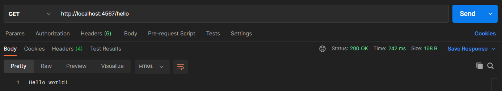
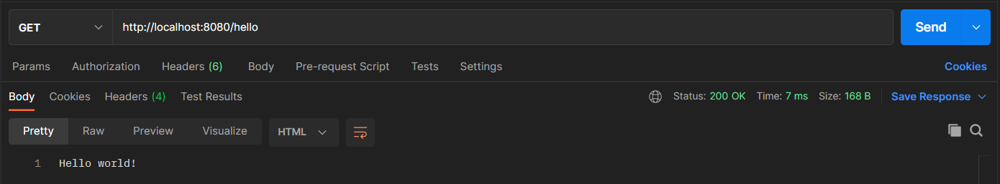

## A web applications micro framework in Kotlin and Java 8 with minimal effort

Spark Framework is a simple and expressive Java/Kotlin web framework DSL built for rapid development. Sparks intention is to provide an alternative for Kotlin/Java developers that want to develop their web applications as expressive as possible and with minimal boilerplate. With a clear philosophy Spark is designed not only to make you more productive, but also to make your code better under the influence of Spark’s sleek, declarative and expressive syntax. <a href="https://sparkjava.com" target="_blank">[More info]</a>

## Getting started (with Java and gradle)


### First add sparkjava dependency

```groovy
 implementation "com.sparkjava:spark-core:2.9.3" 
 ```

### Write an endpoint
```java
import static spark.Spark.get;

public class Api {
    public static void main(String[] args) {
        get("/hello", (request, response) -> "Hello world!");
    }
}
```
Yes, that's the only line you will have to write and no more fluffing around.
That only line will do at least following things for you,

- define a GET endpoint "/hello"
- define response to return "Hello world!" when "/hello" endpoint is hit
- starts web-server on default port which is 4567

Output:



The web server port can be changed by using **port** method as follows,

```java
import static spark.Spark.get;
import static spark.Spark.port;

public class Api {

    public static void main(String[] args) {

        port(8080);
        get("/hello", (request, response) -> "Hello world!");
    }
}    
```

Output:



Here is a <a href="https://github.com/krushnatkhawale/project-gallery-using-sparkjava" target="_blank"> example </a> of a microservice with CRUD operations using sparkjava which uses H2 database which I hope will be useful if you would like to get started with Spark java framework.

### References

- <a href="https://sparkjava.com" target="_blank"> https://sparkjava.com </a>